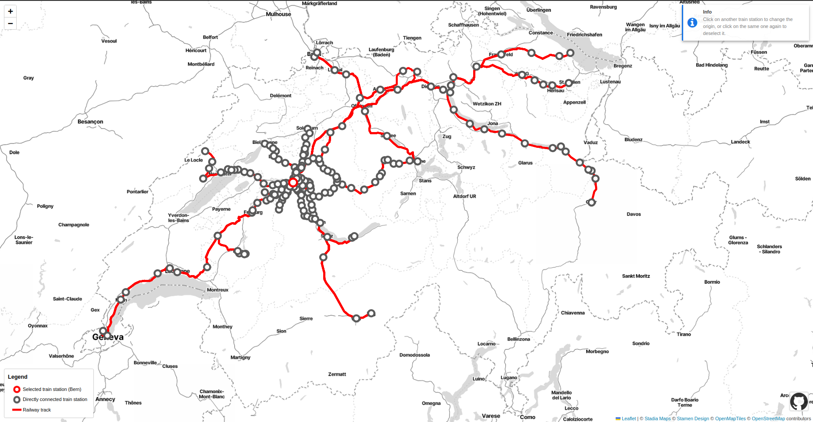

# :light_rail: direktverbindungskarte :light_rail:
A map of direct Swiss railway connections from any station! 

Click on any station on the map to see where you can travel with a direct railway connection. Click on the same station to deselect it, or another station to see where you can go from it.

## Data Limitations
There are three data elements that make up the map:
- Railway stations: only railway stations in Switzerland, with valid geolocation, and in service are considered. In service means that at least one railway ride (German *Fahrt*) had a scheduled stop at the station in the control period -- see point below.
- Railway connections: the origin station has a direct connection with another station if there was a railway ride without transfers that was scheduled to stop at both of them. Only railway rides scheduled to take place in the control period (the ist-data natural day specified in [last_update.txt](https://github.com/COrtsJosep/direktverbindungskarte/blob/main/last_update.txt)) are considered.
- Railway network: it is not implied that connections between two stations travel through the displayed tracks.

## Data Sources
- Rail network lines are taken from the  [swissTNE Base](https://www.swisstopo.admin.ch/de/landschaftsmodell-swisstne-base#download), by the [Federal Office of Topography swisstopo](https://www.swisstopo.admin.ch/de)
- Railway station data is taken from the [Dienststellen Datensatz](https://data.opentransportdata.swiss/dataset/service-point-v2), by the [Geschäftsstelle Systemaufgaben Kundeninformation (SKI)](https://oev-info.ch) hosted at [opentransportdata.swiss](https://opentransportdata.swiss)
- Train connection data comes from the [Ist-Daten Datensatz](https://data.opentransportdata.swiss/dataset/ist-daten-v2), also by the [Geschäftsstelle Systemaufgaben Kundeninformation (SKI)](https://oev-info.ch) hosted at [opentransportdata.swiss](https://opentransportdata.swiss)
- For the map tile source, check the lower right corner of the map

## Credits
Heavily inspired by [Martin Sterchi](https://martinsterchi.ch/)'s [blog publication](https://martinsterchi.ch/blog/sbb_nw/#load-and-preprocess-ist-daten) about the SBB-CFF-FFS network. Also vaguely inspired on [chronotrains](https://www.chronotrains.com/).

The files in [public/vendor/leaflet-control-credits/](https://github.com/COrtsJosep/direktverbindungskarte/blob/main/public/vendor/leaflet-control-credits/) are authored by [Greg Allensworth](https://github.com/gregallensworth) and they were released under a different license, which I have placed inside the folder. GitHub's [Invertocat logo](public/GitHub_Invertocat_Black.png) is GitHub's property. All original code by myself is under the Unlicense (see [LICENSE](LICENSE)).

## Impressions
Direct railway connections from Bern:

